# Does America Agree That "The Empire Strikes Back" is the Best Star Wars Movie?

**For this analysis, we will be using a survey by FiveThirtyEight with a total of 835 responses to answer the following question:**
* **"Does the rest of America realize that “The Empire Strikes Back” is clearly the best of the bunch?"**

**We will also answer these secondary questions:**
* How many respondants have seen each film in the franchise?
* Which film is the best ranked?
* Which film is the worst ranked?
* Which gender is more likely to watch Star Wars?
* Does gender play a role in movie rankings?
* How many respondants consider themselves fans?
* What is the movie ranking difference between fans and non-fans who have seen the films?
* Does Education level have any correlation with having seen the movies?
* Does Education level affect the movie rankings?
* Who do respondants think shot first: Han Solo or Greedo?
* Which characters are the most favorable?
* Which characters are the least favorable?
* Which characters are the most controversial (both favorable and unfavorable)

You can find this dataset here https://github.com/fivethirtyeight/data/tree/master/star-wars-survey if you'd like to download and check it out for yourself.

## Importing and Exploring the Data


```python
import pandas as pd
star_wars = pd.read_csv("star_wars.csv", encoding="ISO-8859-1")
```


```python
star_wars.head(10)
```


<div>
<style scoped>
    .dataframe tbody tr th:only-of-type {
        vertical-align: middle;
    }

    .dataframe tbody tr th {
        vertical-align: top;
    }

    .dataframe thead th {
        text-align: right;
    }
</style>
<table border="1" class="dataframe">
  <thead>
    <tr style="text-align: right;">
      <th></th>
      <th>RespondentID</th>
      <th>Have you seen any of the 6 films in the Star Wars franchise?</th>
      <th>Do you consider yourself to be a fan of the Star Wars film franchise?</th>
      <th>Which of the following Star Wars films have you seen? Please select all that apply.</th>
      <th>Unnamed: 4</th>
      <th>Unnamed: 5</th>
      <th>Unnamed: 6</th>
      <th>Unnamed: 7</th>
      <th>Unnamed: 8</th>
      <th>Please rank the Star Wars films in order of preference with 1 being your favorite film in the franchise and 6 being your least favorite film.</th>
      <th>...</th>
      <th>Unnamed: 28</th>
      <th>Which character shot first?</th>
      <th>Are you familiar with the Expanded Universe?</th>
      <th>Do you consider yourself to be a fan of the Expanded Universe?ξ</th>
      <th>Do you consider yourself to be a fan of the Star Trek franchise?</th>
      <th>Gender</th>
      <th>Age</th>
      <th>Household Income</th>
      <th>Education</th>
      <th>Location (Census Region)</th>
    </tr>
  </thead>
  <tbody>
    <tr>
      <th>0</th>
      <td>NaN</td>
      <td>Response</td>
      <td>Response</td>
      <td>Star Wars: Episode I  The Phantom Menace</td>
      <td>Star Wars: Episode II  Attack of the Clones</td>
      <td>Star Wars: Episode III  Revenge of the Sith</td>
      <td>Star Wars: Episode IV  A New Hope</td>
      <td>Star Wars: Episode V The Empire Strikes Back</td>
      <td>Star Wars: Episode VI Return of the Jedi</td>
      <td>Star Wars: Episode I  The Phantom Menace</td>
      <td>...</td>
      <td>Yoda</td>
      <td>Response</td>
      <td>Response</td>
      <td>Response</td>
      <td>Response</td>
      <td>Response</td>
      <td>Response</td>
      <td>Response</td>
      <td>Response</td>
      <td>Response</td>
    </tr>
    <tr>
      <th>1</th>
      <td>3.292880e+09</td>
      <td>Yes</td>
      <td>Yes</td>
      <td>Star Wars: Episode I  The Phantom Menace</td>
      <td>Star Wars: Episode II  Attack of the Clones</td>
      <td>Star Wars: Episode III  Revenge of the Sith</td>
      <td>Star Wars: Episode IV  A New Hope</td>
      <td>Star Wars: Episode V The Empire Strikes Back</td>
      <td>Star Wars: Episode VI Return of the Jedi</td>
      <td>3</td>
      <td>...</td>
      <td>Very favorably</td>
      <td>I don't understand this question</td>
      <td>Yes</td>
      <td>No</td>
      <td>No</td>
      <td>Male</td>
      <td>18-29</td>
      <td>NaN</td>
      <td>High school degree</td>
      <td>South Atlantic</td>
    </tr>
    <tr>
      <th>2</th>
      <td>3.292880e+09</td>
      <td>No</td>
      <td>NaN</td>
      <td>NaN</td>
      <td>NaN</td>
      <td>NaN</td>
      <td>NaN</td>
      <td>NaN</td>
      <td>NaN</td>
      <td>NaN</td>
      <td>...</td>
      <td>NaN</td>
      <td>NaN</td>
      <td>NaN</td>
      <td>NaN</td>
      <td>Yes</td>
      <td>Male</td>
      <td>18-29</td>
      <td>$0 - $24,999</td>
      <td>Bachelor degree</td>
      <td>West South Central</td>
    </tr>
    <tr>
      <th>3</th>
      <td>3.292765e+09</td>
      <td>Yes</td>
      <td>No</td>
      <td>Star Wars: Episode I  The Phantom Menace</td>
      <td>Star Wars: Episode II  Attack of the Clones</td>
      <td>Star Wars: Episode III  Revenge of the Sith</td>
      <td>NaN</td>
      <td>NaN</td>
      <td>NaN</td>
      <td>1</td>
      <td>...</td>
      <td>Unfamiliar (N/A)</td>
      <td>I don't understand this question</td>
      <td>No</td>
      <td>NaN</td>
      <td>No</td>
      <td>Male</td>
      <td>18-29</td>
      <td>$0 - $24,999</td>
      <td>High school degree</td>
      <td>West North Central</td>
    </tr>
    <tr>
      <th>4</th>
      <td>3.292763e+09</td>
      <td>Yes</td>
      <td>Yes</td>
      <td>Star Wars: Episode I  The Phantom Menace</td>
      <td>Star Wars: Episode II  Attack of the Clones</td>
      <td>Star Wars: Episode III  Revenge of the Sith</td>
      <td>Star Wars: Episode IV  A New Hope</td>
      <td>Star Wars: Episode V The Empire Strikes Back</td>
      <td>Star Wars: Episode VI Return of the Jedi</td>
      <td>5</td>
      <td>...</td>
      <td>Very favorably</td>
      <td>I don't understand this question</td>
      <td>No</td>
      <td>NaN</td>
      <td>Yes</td>
      <td>Male</td>
      <td>18-29</td>
      <td>$100,000 - $149,999</td>
      <td>Some college or Associate degree</td>
      <td>West North Central</td>
    </tr>
    <tr>
      <th>5</th>
      <td>3.292731e+09</td>
      <td>Yes</td>
      <td>Yes</td>
      <td>Star Wars: Episode I  The Phantom Menace</td>
      <td>Star Wars: Episode II  Attack of the Clones</td>
      <td>Star Wars: Episode III  Revenge of the Sith</td>
      <td>Star Wars: Episode IV  A New Hope</td>
      <td>Star Wars: Episode V The Empire Strikes Back</td>
      <td>Star Wars: Episode VI Return of the Jedi</td>
      <td>5</td>
      <td>...</td>
      <td>Somewhat favorably</td>
      <td>Greedo</td>
      <td>Yes</td>
      <td>No</td>
      <td>No</td>
      <td>Male</td>
      <td>18-29</td>
      <td>$100,000 - $149,999</td>
      <td>Some college or Associate degree</td>
      <td>West North Central</td>
    </tr>
    <tr>
      <th>6</th>
      <td>3.292719e+09</td>
      <td>Yes</td>
      <td>Yes</td>
      <td>Star Wars: Episode I  The Phantom Menace</td>
      <td>Star Wars: Episode II  Attack of the Clones</td>
      <td>Star Wars: Episode III  Revenge of the Sith</td>
      <td>Star Wars: Episode IV  A New Hope</td>
      <td>Star Wars: Episode V The Empire Strikes Back</td>
      <td>Star Wars: Episode VI Return of the Jedi</td>
      <td>1</td>
      <td>...</td>
      <td>Very favorably</td>
      <td>Han</td>
      <td>Yes</td>
      <td>No</td>
      <td>Yes</td>
      <td>Male</td>
      <td>18-29</td>
      <td>$25,000 - $49,999</td>
      <td>Bachelor degree</td>
      <td>Middle Atlantic</td>
    </tr>
    <tr>
      <th>7</th>
      <td>3.292685e+09</td>
      <td>Yes</td>
      <td>Yes</td>
      <td>Star Wars: Episode I  The Phantom Menace</td>
      <td>Star Wars: Episode II  Attack of the Clones</td>
      <td>Star Wars: Episode III  Revenge of the Sith</td>
      <td>Star Wars: Episode IV  A New Hope</td>
      <td>Star Wars: Episode V The Empire Strikes Back</td>
      <td>Star Wars: Episode VI Return of the Jedi</td>
      <td>6</td>
      <td>...</td>
      <td>Very favorably</td>
      <td>Han</td>
      <td>Yes</td>
      <td>No</td>
      <td>No</td>
      <td>Male</td>
      <td>18-29</td>
      <td>NaN</td>
      <td>High school degree</td>
      <td>East North Central</td>
    </tr>
    <tr>
      <th>8</th>
      <td>3.292664e+09</td>
      <td>Yes</td>
      <td>Yes</td>
      <td>Star Wars: Episode I  The Phantom Menace</td>
      <td>Star Wars: Episode II  Attack of the Clones</td>
      <td>Star Wars: Episode III  Revenge of the Sith</td>
      <td>Star Wars: Episode IV  A New Hope</td>
      <td>Star Wars: Episode V The Empire Strikes Back</td>
      <td>Star Wars: Episode VI Return of the Jedi</td>
      <td>4</td>
      <td>...</td>
      <td>Very favorably</td>
      <td>Han</td>
      <td>No</td>
      <td>NaN</td>
      <td>Yes</td>
      <td>Male</td>
      <td>18-29</td>
      <td>NaN</td>
      <td>High school degree</td>
      <td>South Atlantic</td>
    </tr>
    <tr>
      <th>9</th>
      <td>3.292654e+09</td>
      <td>Yes</td>
      <td>Yes</td>
      <td>Star Wars: Episode I  The Phantom Menace</td>
      <td>Star Wars: Episode II  Attack of the Clones</td>
      <td>Star Wars: Episode III  Revenge of the Sith</td>
      <td>Star Wars: Episode IV  A New Hope</td>
      <td>Star Wars: Episode V The Empire Strikes Back</td>
      <td>Star Wars: Episode VI Return of the Jedi</td>
      <td>5</td>
      <td>...</td>
      <td>Somewhat favorably</td>
      <td>Han</td>
      <td>No</td>
      <td>NaN</td>
      <td>No</td>
      <td>Male</td>
      <td>18-29</td>
      <td>$0 - $24,999</td>
      <td>Some college or Associate degree</td>
      <td>South Atlantic</td>
    </tr>
  </tbody>
</table>
<p>10 rows × 38 columns</p>
</div>


```python
#Separating row 0 which is additional info for the column names and type of responses:
headings = star_wars.iloc[0]
star_wars = star_wars[1:]
print (headings)
```

    RespondentID                                                                                                                                                                              NaN
    Have you seen any of the 6 films in the Star Wars franchise?                                                                                                                         Response
    Do you consider yourself to be a fan of the Star Wars film franchise?                                                                                                                Response
    Which of the following Star Wars films have you seen? Please select all that apply.                                                                  Star Wars: Episode I  The Phantom Menace
    Unnamed: 4                                                                                                                                        Star Wars: Episode II  Attack of the Clones
    Unnamed: 5                                                                                                                                        Star Wars: Episode III  Revenge of the Sith
    Unnamed: 6                                                                                                                                                  Star Wars: Episode IV  A New Hope
    Unnamed: 7                                                                                                                                       Star Wars: Episode V The Empire Strikes Back
    Unnamed: 8                                                                                                                                           Star Wars: Episode VI Return of the Jedi
    Please rank the Star Wars films in order of preference with 1 being your favorite film in the franchise and 6 being your least favorite film.        Star Wars: Episode I  The Phantom Menace
    Unnamed: 10                                                                                                                                       Star Wars: Episode II  Attack of the Clones
    Unnamed: 11                                                                                                                                       Star Wars: Episode III  Revenge of the Sith
    Unnamed: 12                                                                                                                                                 Star Wars: Episode IV  A New Hope
    Unnamed: 13                                                                                                                                      Star Wars: Episode V The Empire Strikes Back
    Unnamed: 14                                                                                                                                          Star Wars: Episode VI Return of the Jedi
    Please state whether you view the following characters favorably, unfavorably, or are unfamiliar with him/her.                                                                       Han Solo
    Unnamed: 16                                                                                                                                                                    Luke Skywalker
    Unnamed: 17                                                                                                                                                              Princess Leia Organa
    Unnamed: 18                                                                                                                                                                  Anakin Skywalker
    Unnamed: 19                                                                                                                                                                    Obi Wan Kenobi
    Unnamed: 20                                                                                                                                                                 Emperor Palpatine
    Unnamed: 21                                                                                                                                                                       Darth Vader
    Unnamed: 22                                                                                                                                                                  Lando Calrissian
    Unnamed: 23                                                                                                                                                                         Boba Fett
    Unnamed: 24                                                                                                                                                                             C-3P0
    Unnamed: 25                                                                                                                                                                             R2 D2
    Unnamed: 26                                                                                                                                                                     Jar Jar Binks
    Unnamed: 27                                                                                                                                                                     Padme Amidala
    Unnamed: 28                                                                                                                                                                              Yoda
    Which character shot first?                                                                                                                                                          Response
    Are you familiar with the Expanded Universe?                                                                                                                                         Response
    Do you consider yourself to be a fan of the Expanded Universe?ξ                                                                                                                   Response
    Do you consider yourself to be a fan of the Star Trek franchise?                                                                                                                     Response
    Gender                                                                                                                                                                               Response
    Age                                                                                                                                                                                  Response
    Household Income                                                                                                                                                                     Response
    Education                                                                                                                                                                            Response
    Location (Census Region)                                                                                                                                                             Response
    Name: 0, dtype: object


```python
star_wars.columns
```


    Index(['RespondentID',
           'Have you seen any of the 6 films in the Star Wars franchise?',
           'Do you consider yourself to be a fan of the Star Wars film franchise?',
           'Which of the following Star Wars films have you seen? Please select all that apply.',
           'Unnamed: 4', 'Unnamed: 5', 'Unnamed: 6', 'Unnamed: 7', 'Unnamed: 8',
           'Please rank the Star Wars films in order of preference with 1 being your favorite film in the franchise and 6 being your least favorite film.',
           'Unnamed: 10', 'Unnamed: 11', 'Unnamed: 12', 'Unnamed: 13',
           'Unnamed: 14',
           'Please state whether you view the following characters favorably, unfavorably, or are unfamiliar with him/her.',
           'Unnamed: 16', 'Unnamed: 17', 'Unnamed: 18', 'Unnamed: 19',
           'Unnamed: 20', 'Unnamed: 21', 'Unnamed: 22', 'Unnamed: 23',
           'Unnamed: 24', 'Unnamed: 25', 'Unnamed: 26', 'Unnamed: 27',
           'Unnamed: 28', 'Which character shot first?',
           'Are you familiar with the Expanded Universe?',
           'Do you consider yourself to be a fan of the Expanded Universe?ξ',
           'Do you consider yourself to be a fan of the Star Trek franchise?',
           'Gender', 'Age', 'Household Income', 'Education',
           'Location (Census Region)'],
          dtype='object')


## Removing NaN Values from 'RespondentID'


```python
star_wars['RespondentID'] = star_wars['RespondentID'].notnull()
```


```python
cols_missing_values = star_wars.columns[star_wars.isnull().sum() > 0]
cols_missing_values
```


    Index(['Do you consider yourself to be a fan of the Star Wars film franchise?',
           'Which of the following Star Wars films have you seen? Please select all that apply.',
           'Unnamed: 4', 'Unnamed: 5', 'Unnamed: 6', 'Unnamed: 7', 'Unnamed: 8',
           'Please rank the Star Wars films in order of preference with 1 being your favorite film in the franchise and 6 being your least favorite film.',
           'Unnamed: 10', 'Unnamed: 11', 'Unnamed: 12', 'Unnamed: 13',
           'Unnamed: 14',
           'Please state whether you view the following characters favorably, unfavorably, or are unfamiliar with him/her.',
           'Unnamed: 16', 'Unnamed: 17', 'Unnamed: 18', 'Unnamed: 19',
           'Unnamed: 20', 'Unnamed: 21', 'Unnamed: 22', 'Unnamed: 23',
           'Unnamed: 24', 'Unnamed: 25', 'Unnamed: 26', 'Unnamed: 27',
           'Unnamed: 28', 'Which character shot first?',
           'Are you familiar with the Expanded Universe?',
           'Do you consider yourself to be a fan of the Expanded Universe?ξ',
           'Do you consider yourself to be a fan of the Star Trek franchise?',
           'Gender', 'Age', 'Household Income', 'Education',
           'Location (Census Region)'],
          dtype='object')


## Converting "Yes" and "No" columns to "True" and "False" (boolean) values


```python
yes_no_cols = [1,2,30,31,32]

for i in yes_no_cols:
    print (star_wars.columns[i])
    print (star_wars[star_wars.columns[i]].value_counts(dropna=False))
    print('\n')
```

    Have you seen any of the 6 films in the Star Wars franchise?
    Yes    936
    No     250
    Name: Have you seen any of the 6 films in the Star Wars franchise?, dtype: int64
    
    
    Do you consider yourself to be a fan of the Star Wars film franchise?
    Yes    552
    NaN    350
    No     284
    Name: Do you consider yourself to be a fan of the Star Wars film franchise?, dtype: int64
    
    
    Are you familiar with the Expanded Universe?
    No     615
    NaN    358
    Yes    213
    Name: Are you familiar with the Expanded Universe?, dtype: int64
    
    
    Do you consider yourself to be a fan of the Expanded Universe?ξ
    NaN    973
    No     114
    Yes     99
    Name: Do you consider yourself to be a fan of the Expanded Universe?ξ, dtype: int64
    
    
    Do you consider yourself to be a fan of the Star Trek franchise?
    No     641
    Yes    427
    NaN    118
    Name: Do you consider yourself to be a fan of the Star Trek franchise?, dtype: int64
    
    


```python
#renaming a column with strange characters
star_wars.rename(columns={'Do you consider yourself to be a fan of the Expanded Universe?ξ':'Do you consider yourself to be a fan of the Expanded Universe?'}, inplace=True)
```


```python
yes_no = {"Yes": True,
          "No": False}
for i in yes_no_cols:
    star_wars[star_wars.columns[i]] = star_wars[star_wars.columns[i]].map(yes_no)
    print (star_wars[star_wars.columns[i]].value_counts(dropna=False))
    print('\n')
```

    True     936
    False    250
    Name: Have you seen any of the 6 films in the Star Wars franchise?, dtype: int64
    
    
    True     552
    NaN      350
    False    284
    Name: Do you consider yourself to be a fan of the Star Wars film franchise?, dtype: int64
    
    
    False    615
    NaN      358
    True     213
    Name: Are you familiar with the Expanded Universe?, dtype: int64
    
    
    NaN      973
    False    114
    True      99
    Name: Do you consider yourself to be a fan of the Expanded Universe?, dtype: int64
    
    
    False    641
    True     427
    NaN      118
    Name: Do you consider yourself to be a fan of the Star Trek franchise?, dtype: int64
    
    


## Converting Checkbox Reponses to "True" and "False"


```python
import numpy as np

checkbox_cols = [3,4,5,6,7,8]

for i in checkbox_cols:
    print (star_wars.columns[i])
    print (star_wars[star_wars.columns[i]].value_counts(dropna=False))
    print('\n')
```

    Which of the following Star Wars films have you seen? Please select all that apply.
    Star Wars: Episode I  The Phantom Menace    673
    NaN                                         513
    Name: Which of the following Star Wars films have you seen? Please select all that apply., dtype: int64
    
    
    Unnamed: 4
    NaN                                            615
    Star Wars: Episode II  Attack of the Clones    571
    Name: Unnamed: 4, dtype: int64
    
    
    Unnamed: 5
    NaN                                            636
    Star Wars: Episode III  Revenge of the Sith    550
    Name: Unnamed: 5, dtype: int64
    
    
    Unnamed: 6
    Star Wars: Episode IV  A New Hope    607
    NaN                                  579
    Name: Unnamed: 6, dtype: int64
    
    
    Unnamed: 7
    Star Wars: Episode V The Empire Strikes Back    758
    NaN                                             428
    Name: Unnamed: 7, dtype: int64
    
    
    Unnamed: 8
    Star Wars: Episode VI Return of the Jedi    738
    NaN                                         448
    Name: Unnamed: 8, dtype: int64
    
    


```python

seen_movie = {
    'Star Wars: Episode I  The Phantom Menace': True,
    'Star Wars: Episode II  Attack of the Clones': True,
    'Star Wars: Episode III  Revenge of the Sith': True,
    'Star Wars: Episode IV  A New Hope': True,
    'Star Wars: Episode V The Empire Strikes Back': True,
    'Star Wars: Episode VI Return of the Jedi': True,
    np.NaN: False
}

for i in checkbox_cols:
    star_wars[star_wars.columns[i]] = star_wars[star_wars.columns[i]].map(seen_movie)
    print(star_wars[star_wars.columns[i]].value_counts(dropna=False))
    print('\n')
    
```

    True     673
    False    513
    Name: Which of the following Star Wars films have you seen? Please select all that apply., dtype: int64
    
    
    False    615
    True     571
    Name: Unnamed: 4, dtype: int64
    
    
    False    636
    True     550
    Name: Unnamed: 5, dtype: int64
    
    
    True     607
    False    579
    Name: Unnamed: 6, dtype: int64
    
    
    True     758
    False    428
    Name: Unnamed: 7, dtype: int64
    
    
    True     738
    False    448
    Name: Unnamed: 8, dtype: int64
    
    


## Renaming the above columns for ease of use

The columns for this question are:</b>

"*Which of the following Star Wars films have you seen? Please select all that apply.* - Whether or not the respondent saw **'Star Wars: Episode I The Phantom Menace'.**"

"*Unnamed: 4* - Whether or not the respondent saw **'Star Wars: Episode II Attack of the Clones'.**"

"*Unnamed: 5* - Whether or not the respondent saw **'Star Wars: Episode III Revenge of the Sith'.**"

"*Unnamed: 6* - Whether or not the respondent saw **'Star Wars: Episode IV A New Hope'.**"

"*Unnamed: 7* - Whether or not the respondent saw **'Star Wars: Episode V The Empire Strikes Back'.**"

"*Unnamed: 8* - Whether or not the respondent saw **'Star Wars: Episode VI Return of the Jedi'.**"


```python
movie_titles = {
    'Which of the following Star Wars films have you seen? Please select all that apply.': 'seen_ep1',
    'Unnamed: 4': 'seen_ep2',
    'Unnamed: 5': 'seen_ep3',
    'Unnamed: 6': 'seen_ep4',
    'Unnamed: 7': 'seen_ep5',
    'Unnamed: 8': 'seen_ep6',
}

star_wars.rename(mapper=movie_titles, axis=1, inplace=True)
print (star_wars.columns)
    
```

    Index(['RespondentID',
           'Have you seen any of the 6 films in the Star Wars franchise?',
           'Do you consider yourself to be a fan of the Star Wars film franchise?',
           'seen_ep1', 'seen_ep2', 'seen_ep3', 'seen_ep4', 'seen_ep5', 'seen_ep6',
           'Please rank the Star Wars films in order of preference with 1 being your favorite film in the franchise and 6 being your least favorite film.',
           'Unnamed: 10', 'Unnamed: 11', 'Unnamed: 12', 'Unnamed: 13',
           'Unnamed: 14',
           'Please state whether you view the following characters favorably, unfavorably, or are unfamiliar with him/her.',
           'Unnamed: 16', 'Unnamed: 17', 'Unnamed: 18', 'Unnamed: 19',
           'Unnamed: 20', 'Unnamed: 21', 'Unnamed: 22', 'Unnamed: 23',
           'Unnamed: 24', 'Unnamed: 25', 'Unnamed: 26', 'Unnamed: 27',
           'Unnamed: 28', 'Which character shot first?',
           'Are you familiar with the Expanded Universe?',
           'Do you consider yourself to be a fan of the Expanded Universe?',
           'Do you consider yourself to be a fan of the Star Trek franchise?',
           'Gender', 'Age', 'Household Income', 'Education',
           'Location (Census Region)'],
          dtype='object')


## Converting rating responses to numeric type


```python
star_wars[star_wars.columns[9:15]] = star_wars[star_wars.columns[9:15]].astype(float)

```

## Renaming the above columns for ease of use


```python
movie_rankings = {
    'Please rank the Star Wars films in order of preference with 1 being your favorite film in the franchise and 6 being your least favorite film.': 'ranking_ep1',
    'Unnamed: 10': 'ranking_ep2',
    'Unnamed: 11': 'ranking_ep3',
    'Unnamed: 12': 'ranking_ep4',
    'Unnamed: 13': 'ranking_ep5',
    'Unnamed: 14': 'ranking_ep6',
}

star_wars.rename(mapper=movie_rankings, axis=1, inplace=True)
print (star_wars.columns)
```

    Index(['RespondentID',
           'Have you seen any of the 6 films in the Star Wars franchise?',
           'Do you consider yourself to be a fan of the Star Wars film franchise?',
           'seen_ep1', 'seen_ep2', 'seen_ep3', 'seen_ep4', 'seen_ep5', 'seen_ep6',
           'ranking_ep1', 'ranking_ep2', 'ranking_ep3', 'ranking_ep4',
           'ranking_ep5', 'ranking_ep6',
           'Please state whether you view the following characters favorably, unfavorably, or are unfamiliar with him/her.',
           'Unnamed: 16', 'Unnamed: 17', 'Unnamed: 18', 'Unnamed: 19',
           'Unnamed: 20', 'Unnamed: 21', 'Unnamed: 22', 'Unnamed: 23',
           'Unnamed: 24', 'Unnamed: 25', 'Unnamed: 26', 'Unnamed: 27',
           'Unnamed: 28', 'Which character shot first?',
           'Are you familiar with the Expanded Universe?',
           'Do you consider yourself to be a fan of the Expanded Universe?',
           'Do you consider yourself to be a fan of the Star Trek franchise?',
           'Gender', 'Age', 'Household Income', 'Education',
           'Location (Census Region)'],
          dtype='object')


## Finding the mean ranking for each Star Wars Movie


```python
mean_rankings = star_wars[star_wars.columns[9:15]].mean(skipna=True)
mean_rankings
```


    ranking_ep1    3.732934
    ranking_ep2    4.087321
    ranking_ep3    4.341317
    ranking_ep4    3.272727
    ranking_ep5    2.513158
    ranking_ep6    3.047847
    dtype: float64


## Making a bar chart for each movie ranking


```python
#importing the matplotlib and seaborn libraries
import matplotlib.pyplot as plt
%matplotlib inline
import seaborn as sns

```


```python
#Plotting all 'seen movie' data together
N = 6

# values of blue bars (height)
mean_bars = (mean_rankings)

# Position of bars on x-axis
ind = np.arange(N)

# Figure size
plt.figure(figsize=(12,6))

# Width of a bar 
width = 0.5       

# Plotting
plt.bar(ind, mean_bars, width, color='blue', label='Mean Rankings')

plt.xlabel('Movies', size=14)
plt.ylabel('Mean Rankings', size=14)
plt.title('Mean Movie Rankings: All Respondants', size=22)

# xticks()
# First argument - A list of positions at which ticks should be placed
# Second argument -  A list of labels to place at the given locations
plt.xticks(ind + (width/2), ('seen_ep1', 'seen_ep2', 'seen_ep3', 'seen_ep4', 'seen_ep5', 'seen_ep6'))

plt.show()
```


    
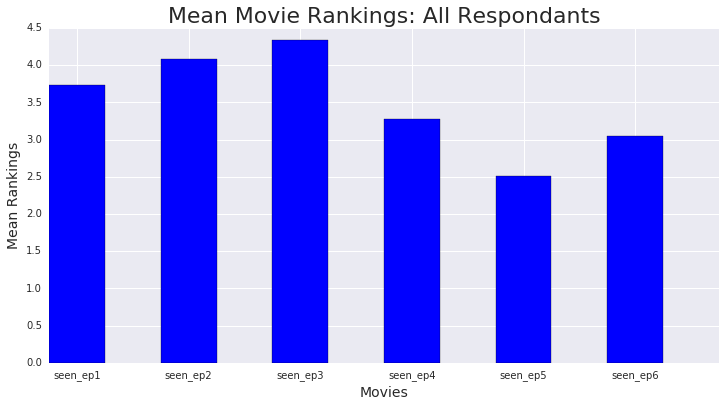
    


## Takeaways from the rankings

Episode V: The Empire Strikes Back, is the highest ranked, followed by Episode VI and then Episode IV. Unsurprisingly, Episodes I-III are the lowest ranked. As a fan of the Star Wars series myself, and knowing the general reactions to the movies when they came out, I think the rankings from this survey make sense. Episodes I-III were highly anticipated but most Star Wars loyalists were disappointed and did not appreciate the deviations from the original movie styles and thought the movies to have too much politics and not enough humor. The original 3, Episodes IV-VI, have always been highly regarded amongst fans of the film franchise as the best in the series. Episode V introduces a lot of iconic characters and scenes, including Jabba the Hut and Boba Fett and the love triangle developing between 3 of the main characters, and that's what gives it a ranking boost over episode IV, which is more of an introduction into the main characters and storyline.

## Computing the sum of each 'seen' column


```python
seen_sum = star_wars[star_wars.columns[3:9]].sum()
seen_sum

```


    seen_ep1    673
    seen_ep2    571
    seen_ep3    550
    seen_ep4    607
    seen_ep5    758
    seen_ep6    738
    dtype: int64


## Making a bar chart of the sums of seen columns


```python
#Plotting all 'seen movie' data together
N = 6

# values of orange bars (height)
seen_bars = (seen_sum)

# Position of bars on x-axis
ind = np.arange(N)

# Figure size
plt.figure(figsize=(12,6))

# Width of a bar 
width = 0.5       

# Plotting
plt.bar(ind, seen_bars, width, color='orange', label='Seen Movie')

plt.xlabel('Movies', size=14)
plt.ylabel('# of Respondants Seen Movie', size=14)
plt.title('Seen Movie Sum: All Respondants', size=22)

# xticks()
# First argument - A list of positions at which ticks should be placed
# Second argument -  A list of labels to place at the given locations
plt.xticks(ind + (width/2), ('seen_ep1', 'seen_ep2', 'seen_ep3', 'seen_ep4', 'seen_ep5', 'seen_ep6'))

plt.show()
```


    
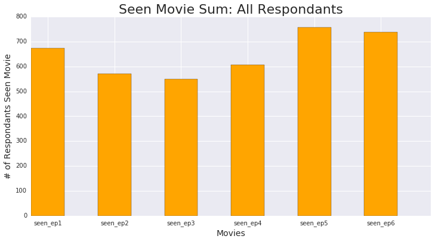
    


## Takeaways from the sumations of seen movies

The sums of the 'seen_movie' columns are directly inverse from the rankings, and given that the lower the ranking the higher the rating of the movie, this makes sense. We can see that Episode V: The Empire Strikes Back, is the most watched movie in the series, and it is also the highest rated based on the mean rankings. We see that each sum of how many survey respondants watched each movie corresponds accordingly with how it's ranked. This could mean that ratings had a positive or negative effect on how many people watched each movie, or it could mean that the number of people that watched each movie has an effect on the ratings. I believe it makes more sense to say the former would be more influential than the latter, as the number of respondants shouldn't necessarily affect the rating, which is an average, as much as the ratings may influence the number of movie viewers, although both might play a role.

## Splitting the data by gender


```python
sw_males = star_wars[star_wars["Gender"] == "Male"]
sw_females = star_wars[star_wars["Gender"] == "Female"]

```

## Star Wars movies seen and ranked split by gender


```python
#How many males have seen each movie
checkbox_cols_m = [3,4,5,6,7,8]

for i in checkbox_cols_m:
    print (sw_males.columns[i])
    print (sw_males[sw_males.columns[i]].value_counts(dropna=False))
    print('\n')

```

    seen_ep1
    True     361
    False    136
    Name: seen_ep1, dtype: int64
    
    
    seen_ep2
    True     323
    False    174
    Name: seen_ep2, dtype: int64
    
    
    seen_ep3
    True     317
    False    180
    Name: seen_ep3, dtype: int64
    
    
    seen_ep4
    True     342
    False    155
    Name: seen_ep4, dtype: int64
    
    
    seen_ep5
    True     392
    False    105
    Name: seen_ep5, dtype: int64
    
    
    seen_ep6
    True     387
    False    110
    Name: seen_ep6, dtype: int64
    
    


```python
#How many females have seen each movie
checkbox_cols_f = [3,4,5,6,7,8]

for i in checkbox_cols_f:
    print (sw_females.columns[i])
    print (sw_females[sw_females.columns[i]].value_counts(dropna=False))
    print('\n')

```

    seen_ep1
    True     298
    False    251
    Name: seen_ep1, dtype: int64
    
    
    seen_ep2
    False    312
    True     237
    Name: seen_ep2, dtype: int64
    
    
    seen_ep3
    False    327
    True     222
    Name: seen_ep3, dtype: int64
    
    
    seen_ep4
    False    294
    True     255
    Name: seen_ep4, dtype: int64
    
    
    seen_ep5
    True     353
    False    196
    Name: seen_ep5, dtype: int64
    
    
    seen_ep6
    True     338
    False    211
    Name: seen_ep6, dtype: int64
    
    


```python
seen_sum_m = sw_males[sw_males.columns[3:9]].sum()
print (seen_sum_m)
print ('\n')

seen_sum_f = sw_females[sw_females.columns[3:9]].sum()
print (seen_sum_f)

```

    seen_ep1    361
    seen_ep2    323
    seen_ep3    317
    seen_ep4    342
    seen_ep5    392
    seen_ep6    387
    dtype: int64
    
    
    seen_ep1    298
    seen_ep2    237
    seen_ep3    222
    seen_ep4    255
    seen_ep5    353
    seen_ep6    338
    dtype: int64


```python
#Plotting male and female seen movie data together
N = 6

# values of blue bars (height)
seen_male = (seen_sum_m)
# values of orange bars (height)
seen_female = (seen_sum_f)

# Position of bars on x-axis
ind = np.arange(N)

# Figure size
plt.figure(figsize=(12,6))

# Width of a bar 
width = 0.3       

# Plotting
plt.bar(ind, seen_male, width, color='blue', label='Males')
plt.bar(ind + width, seen_female, width, color='orange', label='Females')

plt.xlabel('Seen Movie Sum', size=14)
plt.ylabel('# of Respondants Seen Movie', size=14)
plt.title('Seen Movie Sum by Gender', size=22)

# xticks()
# First argument - A list of positions at which ticks should be placed
# Second argument -  A list of labels to place at the given locations
plt.xticks(ind + (width*2) / 2, ('seen_ep1', 'seen_ep2', 'seen_ep3', 'seen_ep4', 'seen_ep5', 'seen_ep6'))

# Finding the best position for legends and putting it
plt.legend(loc='best')
plt.show()
```


    
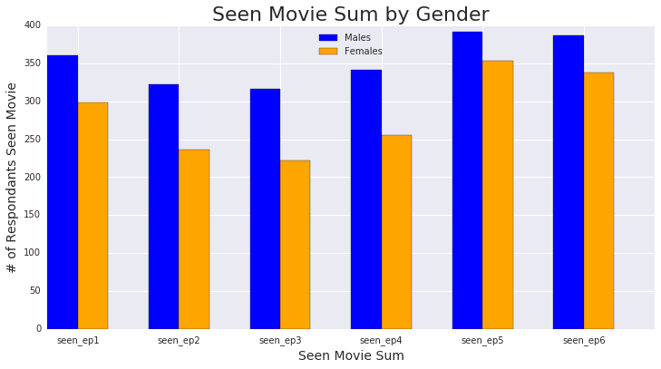
    


We can see there are generally more males who've seen each of the Star Wars films, but there is a narrower gap between male and female when it comes to Episode V followed by Episode VI.

## Charting mean ranking split by gender


```python
mean_rankings_m = sw_males[sw_males.columns[9:15]].mean(skipna=True)
print (mean_rankings_m)
print ('\n')
mean_rankings_f = sw_females[sw_females.columns[9:15]].mean(skipna=True)
print (mean_rankings_f)

```

    ranking_ep1    4.037825
    ranking_ep2    4.224586
    ranking_ep3    4.274882
    ranking_ep4    2.997636
    ranking_ep5    2.458629
    ranking_ep6    3.002364
    dtype: float64
    
    
    ranking_ep1    3.429293
    ranking_ep2    3.954660
    ranking_ep3    4.418136
    ranking_ep4    3.544081
    ranking_ep5    2.569270
    ranking_ep6    3.078086
    dtype: float64


```python
#Plotting male and female movie ranking data together
N = 6

# values of blue bars (height)
male_mean = (mean_rankings_m)
# values of orange bars (height)
female_mean = (mean_rankings_f)

# Position of bars on x-axis
ind = np.arange(N)

# Figure size
plt.figure(figsize=(12,6))

# Width of a bar 
width = 0.3       

# Plotting
plt.bar(ind, male_mean, width, color='blue', label='Males')
plt.bar(ind + width, female_mean, width, color='orange', label='Females')

plt.xlabel('Movie Episode', size=14)
plt.ylabel('Mean Movie Ranking', size=14)
plt.title('Mean Movie Ranking by Gender', size=22)

# xticks()
# First argument - A list of positions at which ticks should be placed
# Second argument -  A list of labels to place at the given locations
plt.xticks(ind + (width*2) / 2, ('ranking_ep1', 'ranking_ep2', 'ranking_ep3', 'ranking_ep4', 'ranking_ep5', 'ranking_ep6'))

# Finding the best position for legends and putting it
plt.legend(loc='best')
plt.show()
```


    
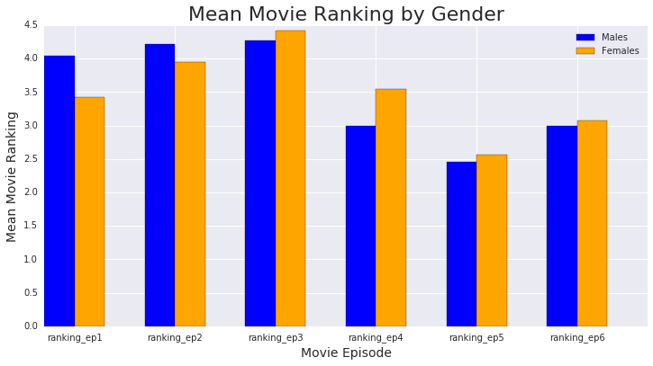
    


## Observations
While most of the rankings follow the same ranking order, we can see there is a difference in how males and females rated the movies in this survey. Both rate Episode V: The Empire Strikes Back as the best and the ranking is close when it comes to the split in gender. Episode VI is also close in ranking but while males equally ranked Episodes IV and VI, females ranked Episode VI higher than Episode IV. Females also rated Episodes I and II higher than males did, but liked Episode III even less than the male respondants. Again, we see that the seen columns directly correspond to the rankings, with the highest rated being the most seen and vice-versa.<br/>
<br/>
**Males movie ranking order:
Episode V<br/>
Episode IV & Episode VI<br/>
Episode I<br/>
Episode II<br/>
Episode III.<br/>
<br/>
Females movie ranking order: <br/>
Episode V<br/>
Episode VI<br/>
Episode I<br/>
Episode IV<br/>
Episode II<br/>
Episode III.**<br/>
<br/>

## Filtering the data by fans of the franchise vs. non-fans


```python
# How many respondants are fans and how many are not?
star_wars['Do you consider yourself to be a fan of the Star Wars film franchise?'].value_counts(dropna=False)

```


    True     552
    NaN      350
    False    284
    Name: Do you consider yourself to be a fan of the Star Wars film franchise?, dtype: int64


```python
sw_fans = star_wars[star_wars['Do you consider yourself to be a fan of the Star Wars film franchise?'] == True]
print (sw_fans.head())
print ('\n')
sw_nonfans = star_wars[star_wars['Do you consider yourself to be a fan of the Star Wars film franchise?'] == False]
print (sw_nonfans.head())

```

       RespondentID  Have you seen any of the 6 films in the Star Wars franchise?  \
    1          True                                               True              
    4          True                                               True              
    5          True                                               True              
    6          True                                               True              
    7          True                                               True              
    
      Do you consider yourself to be a fan of the Star Wars film franchise?  \
    1                                               True                      
    4                                               True                      
    5                                               True                      
    6                                               True                      
    7                                               True                      
    
       seen_ep1  seen_ep2  seen_ep3  seen_ep4  seen_ep5  seen_ep6  ranking_ep1  \
    1      True      True      True      True      True      True          3.0   
    4      True      True      True      True      True      True          5.0   
    5      True      True      True      True      True      True          5.0   
    6      True      True      True      True      True      True          1.0   
    7      True      True      True      True      True      True          6.0   
    
                ...                    Unnamed: 28  \
    1           ...                 Very favorably   
    4           ...                 Very favorably   
    5           ...             Somewhat favorably   
    6           ...                 Very favorably   
    7           ...                 Very favorably   
    
            Which character shot first?  \
    1  I don't understand this question   
    4  I don't understand this question   
    5                            Greedo   
    6                               Han   
    7                               Han   
    
       Are you familiar with the Expanded Universe?  \
    1                                          True   
    4                                         False   
    5                                          True   
    6                                          True   
    7                                          True   
    
       Do you consider yourself to be a fan of the Expanded Universe?  \
    1                                              False                
    4                                                NaN                
    5                                              False                
    6                                              False                
    7                                              False                
    
       Do you consider yourself to be a fan of the Star Trek franchise? Gender  \
    1                                              False                  Male   
    4                                               True                  Male   
    5                                              False                  Male   
    6                                               True                  Male   
    7                                              False                  Male   
    
         Age     Household Income                         Education  \
    1  18-29                  NaN                High school degree   
    4  18-29  $100,000 - $149,999  Some college or Associate degree   
    5  18-29  $100,000 - $149,999  Some college or Associate degree   
    6  18-29    $25,000 - $49,999                   Bachelor degree   
    7  18-29                  NaN                High school degree   
    
      Location (Census Region)  
    1           South Atlantic  
    4       West North Central  
    5       West North Central  
    6          Middle Atlantic  
    7       East North Central  
    
    [5 rows x 38 columns]
    
    
        RespondentID  \
    3           True   
    10          True   
    13          True   
    22          True   
    31          True   
    
        Have you seen any of the 6 films in the Star Wars franchise?  \
    3                                                True              
    10                                               True              
    13                                               True              
    22                                               True              
    31                                               True              
    
       Do you consider yourself to be a fan of the Star Wars film franchise?  \
    3                                               False                      
    10                                              False                      
    13                                              False                      
    22                                              False                      
    31                                              False                      
    
        seen_ep1  seen_ep2  seen_ep3  seen_ep4  seen_ep5  seen_ep6  ranking_ep1  \
    3       True      True      True     False     False     False          1.0   
    10     False      True     False     False     False     False          1.0   
    13      True      True      True      True      True      True          3.0   
    22      True      True      True      True      True     False          3.0   
    31      True      True      True      True      True      True          4.0   
    
                 ...                                             Unnamed: 28  \
    3            ...                                        Unfamiliar (N/A)   
    10           ...                                          Very favorably   
    13           ...                                          Very favorably   
    22           ...             Neither favorably nor unfavorably (neutral)   
    31           ...                                      Somewhat favorably   
    
             Which character shot first?  \
    3   I don't understand this question   
    10  I don't understand this question   
    13                            Greedo   
    22  I don't understand this question   
    31  I don't understand this question   
    
        Are you familiar with the Expanded Universe?  \
    3                                          False   
    10                                         False   
    13                                         False   
    22                                         False   
    31                                         False   
    
        Do you consider yourself to be a fan of the Expanded Universe?  \
    3                                                 NaN                
    10                                                NaN                
    13                                                NaN                
    22                                                NaN                
    31                                                NaN                
    
        Do you consider yourself to be a fan of the Star Trek franchise? Gender  \
    3                                               False                  Male   
    10                                              False                  Male   
    13                                              False                  Male   
    22                                              False                  Male   
    31                                              False                  Male   
    
          Age   Household Income                         Education  \
    3   18-29       $0 - $24,999                High school degree   
    10  18-29  $25,000 - $49,999  Some college or Associate degree   
    13  18-29  $25,000 - $49,999                   Bachelor degree   
    22  18-29                NaN                   Bachelor degree   
    31  30-44       $0 - $24,999                High school degree   
    
       Location (Census Region)  
    3        West North Central  
    10                  Pacific  
    13           South Atlantic  
    22                  Pacific  
    31              New England  
    
    [5 rows x 38 columns]


## Star Wars Fans seen and ranked Star Wars movies


```python
#How many fans have seen each movie
checkbox_cols_fans = [3,4,5,6,7,8]

for i in checkbox_cols_fans:
    print (sw_fans.columns[i])
    print (sw_fans[sw_fans.columns[i]].value_counts(dropna=False))
    print('\n')
```

    seen_ep1
    True     500
    False     52
    Name: seen_ep1, dtype: int64
    
    
    seen_ep2
    True     463
    False     89
    Name: seen_ep2, dtype: int64
    
    
    seen_ep3
    True     450
    False    102
    Name: seen_ep3, dtype: int64
    
    
    seen_ep4
    True     483
    False     69
    Name: seen_ep4, dtype: int64
    
    
    seen_ep5
    True     538
    False     14
    Name: seen_ep5, dtype: int64
    
    
    seen_ep6
    True     537
    False     15
    Name: seen_ep6, dtype: int64
    
    


```python
#How many non-fans have seen each movie
checkbox_cols_nfans = [3,4,5,6,7,8]

for i in checkbox_cols_nfans:
    print (sw_nonfans.columns[i])
    print (sw_nonfans[sw_nonfans.columns[i]].value_counts(dropna=False))
    print('\n')
```

    seen_ep1
    True     173
    False    111
    Name: seen_ep1, dtype: int64
    
    
    seen_ep2
    False    176
    True     108
    Name: seen_ep2, dtype: int64
    
    
    seen_ep3
    False    184
    True     100
    Name: seen_ep3, dtype: int64
    
    
    seen_ep4
    False    160
    True     124
    Name: seen_ep4, dtype: int64
    
    
    seen_ep5
    True     220
    False     64
    Name: seen_ep5, dtype: int64
    
    
    seen_ep6
    True     201
    False     83
    Name: seen_ep6, dtype: int64
    
    


```python
seen_sum_fans = sw_fans[sw_fans.columns[3:9]].sum()
print (seen_sum_fans)
print ('\n')

seen_sum_nfans = sw_nonfans[sw_nonfans.columns[3:9]].sum()
print (seen_sum_nfans)

```

    seen_ep1    500
    seen_ep2    463
    seen_ep3    450
    seen_ep4    483
    seen_ep5    538
    seen_ep6    537
    dtype: int64
    
    
    seen_ep1    173
    seen_ep2    108
    seen_ep3    100
    seen_ep4    124
    seen_ep5    220
    seen_ep6    201
    dtype: int64


```python
#Plotting fans and non-fans seen movie data together
N = 6

# values of blue bars (height)
seen_fans = (seen_sum_fans)
# values of orange bars (height)
seen_nonfans = (seen_sum_nfans)

# Position of bars on x-axis
ind = np.arange(N)

# Figure size
plt.figure(figsize=(12,6))

# Width of a bar 
width = 0.3       

# Plotting
plt.bar(ind, seen_fans, width, color='blue', label='Fans')
plt.bar(ind + width, seen_nonfans, width, color='orange', label='Non-fans')

plt.xlabel('Seen Movie Sum', size=14)
plt.ylabel('# of Respondants Seen Movie', size=14)
plt.title('Seen Movie Sum by Fans vs. Non-fans', size=22)

# xticks()
# First argument - A list of positions at which ticks should be placed
# Second argument -  A list of labels to place at the given locations
plt.xticks(ind + (width*2) / 2, ('seen_ep1', 'seen_ep2', 'seen_ep3', 'seen_ep4', 'seen_ep5', 'seen_ep6'))

# Finding the best position for legends and putting it
plt.legend(loc='best')
plt.show()
```


    
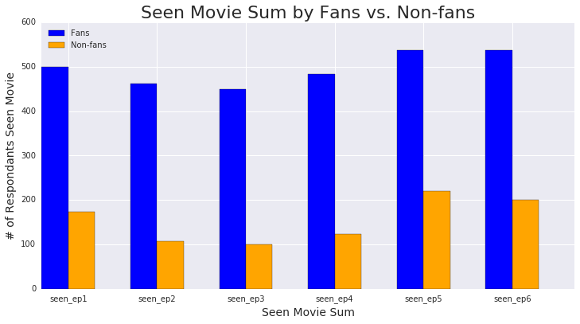
    


There is a very obvious difference between fans and non-fans of the franchise when it comes to survey reponses. Fans more than double the amount of repondants who've seen the films vs. non-fans.

## Charting mean rankings of the movies by fans and non-fans


```python
mean_rankings_fans = sw_fans[sw_fans.columns[9:15]].mean(skipna=True)
print (mean_rankings_fans)
print ('\n')
mean_rankings_nfans = sw_nonfans[sw_nonfans.columns[9:15]].mean(skipna=True)
print (mean_rankings_nfans)

```

    ranking_ep1    4.141304
    ranking_ep2    4.342391
    ranking_ep3    4.417423
    ranking_ep4    2.932971
    ranking_ep5    2.333333
    ranking_ep6    2.829710
    dtype: float64
    
    
    ranking_ep1    2.936396
    ranking_ep2    3.591549
    ranking_ep3    4.193662
    ranking_ep4    3.933099
    ranking_ep5    2.862676
    ranking_ep6    3.471831
    dtype: float64


```python
#Plotting fans vs. nonfans movie ranking data together
N = 6

# values of blue bars (height)
mean_fans = (mean_rankings_fans)
# values of orange bars (height)
mean_nonfans = (mean_rankings_nfans)

# Position of bars on x-axis
ind = np.arange(N)

# Figure size
plt.figure(figsize=(12,6))

# Width of a bar 
width = 0.3       

# Plotting
plt.bar(ind, mean_fans, width, color='blue', label='Fans')
plt.bar(ind + width, mean_nonfans, width, color='orange', label='Non-fans')

plt.xlabel('Movie Episode', size=14)
plt.ylabel('Mean Movie Ranking', size=14)
plt.title('Mean Movie Ranking by Fans vs. Non-fans', size=22)

# xticks()
# First argument - A list of positions at which ticks should be placed
# Second argument -  A list of labels to place at the given locations
plt.xticks(ind + (width*2) / 2, ('ranking_ep1', 'ranking_ep2', 'ranking_ep3', 'ranking_ep4', 'ranking_ep5', 'ranking_ep6'))

# Finding the best position for legends and putting it
plt.legend(loc='best')
plt.show()
```


    
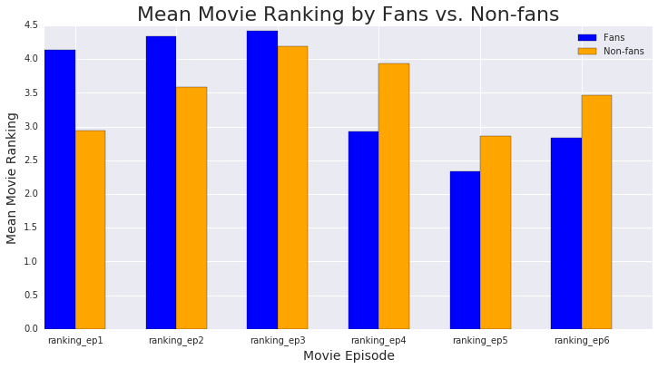
    


Again we see a big difference in the way fans and non-fans of the Star Wars films responded in the survey. Here we see that the ranking order for the films differs for the two subsets. The few constants have been that Episode V is consistantly ranked the best and Episode III consistantly ranked the worst.<br/>
<br/>
**Non-fans rank the films in the following order: <br/>
Episode V<br/>
Episode I<br/>
Episode VI<br/>
Episode II<br/>
Episode IV<br/>
Episode III.<br/>
<br/>
Fans rank the films in the following order: <br/>
Episode V<br/>
Episode VI<br/>
Episode IV<br/>
Episode I<br/>
Episode II<br/>
Episode III.**<br/>
<br/>
The fans of the franchise are clearly loyalists to the original 3 movies and did not like the deviations in Episodes I-III which were released much later in the year 2000s. Meanwhile, non-fans of the franchise who rated the movies tended to be more forgiving of the newer movies and did not like the first movie in the original series as much.

## Segmenting the data based on 'Which character shot first?'


```python
print (star_wars['Which character shot first?'].value_counts(dropna=False))

```

    NaN                                 358
    Han                                 325
    I don't understand this question    306
    Greedo                              197
    Name: Which character shot first?, dtype: int64


```python
character_map = {
    "Han": True,
    "Greedo": False,
    "I don't understand this question": np.NaN
}

star_wars['Which character shot first?'] = star_wars['Which character shot first?'].map(character_map)
print(star_wars['Which character shot first?'].value_counts(dropna=False))

```

    NaN      664
    True     325
    False    197
    Name: Which character shot first?, dtype: int64


```python
han = star_wars[star_wars['Which character shot first?'] == True]
greedo = star_wars[star_wars['Which character shot first?'] == False]
print (han.head())
print ('\n')
print (greedo.head())

```

        RespondentID  \
    6           True   
    7           True   
    8           True   
    9           True   
    15          True   
    
        Have you seen any of the 6 films in the Star Wars franchise?  \
    6                                                True              
    7                                                True              
    8                                                True              
    9                                                True              
    15                                               True              
    
       Do you consider yourself to be a fan of the Star Wars film franchise?  \
    6                                                True                      
    7                                                True                      
    8                                                True                      
    9                                                True                      
    15                                               True                      
    
        seen_ep1  seen_ep2  seen_ep3  seen_ep4  seen_ep5  seen_ep6  ranking_ep1  \
    6       True      True      True      True      True      True          1.0   
    7       True      True      True      True      True      True          6.0   
    8       True      True      True      True      True      True          4.0   
    9       True      True      True      True      True      True          5.0   
    15      True      True      True      True      True      True          4.0   
    
                 ...                    Unnamed: 28  Which character shot first?  \
    6            ...                 Very favorably                         True   
    7            ...                 Very favorably                         True   
    8            ...                 Very favorably                         True   
    9            ...             Somewhat favorably                         True   
    15           ...                 Very favorably                         True   
    
        Are you familiar with the Expanded Universe?  \
    6                                           True   
    7                                           True   
    8                                          False   
    9                                          False   
    15                                         False   
    
        Do you consider yourself to be a fan of the Expanded Universe?  \
    6                                               False                
    7                                               False                
    8                                                 NaN                
    9                                                 NaN                
    15                                                NaN                
    
        Do you consider yourself to be a fan of the Star Trek franchise? Gender  \
    6                                                True                  Male   
    7                                               False                  Male   
    8                                                True                  Male   
    9                                               False                  Male   
    15                                              False                  Male   
    
          Age   Household Income                         Education  \
    6   18-29  $25,000 - $49,999                   Bachelor degree   
    7   18-29                NaN                High school degree   
    8   18-29                NaN                High school degree   
    9   18-29       $0 - $24,999  Some college or Associate degree   
    15  18-29                NaN                High school degree   
    
       Location (Census Region)  
    6           Middle Atlantic  
    7        East North Central  
    8            South Atlantic  
    9            South Atlantic  
    15       East North Central  
    
    [5 rows x 38 columns]
    
    
        RespondentID  \
    5           True   
    13          True   
    18          True   
    20          True   
    23          True   
    
        Have you seen any of the 6 films in the Star Wars franchise?  \
    5                                                True              
    13                                               True              
    18                                               True              
    20                                               True              
    23                                               True              
    
       Do you consider yourself to be a fan of the Star Wars film franchise?  \
    5                                                True                      
    13                                              False                      
    18                                               True                      
    20                                               True                      
    23                                               True                      
    
        seen_ep1  seen_ep2  seen_ep3  seen_ep4  seen_ep5  seen_ep6  ranking_ep1  \
    5       True      True      True      True      True      True          5.0   
    13      True      True      True      True      True      True          3.0   
    18      True      True      True     False     False      True          1.0   
    20      True      True      True      True      True      True          6.0   
    23      True      True      True      True      True      True          6.0   
    
                 ...                    Unnamed: 28  Which character shot first?  \
    5            ...             Somewhat favorably                        False   
    13           ...                 Very favorably                        False   
    18           ...                 Very favorably                        False   
    20           ...                 Very favorably                        False   
    23           ...                 Very favorably                        False   
    
        Are you familiar with the Expanded Universe?  \
    5                                           True   
    13                                         False   
    18                                         False   
    20                                         False   
    23                                          True   
    
        Do you consider yourself to be a fan of the Expanded Universe?  \
    5                                               False                
    13                                                NaN                
    18                                                NaN                
    20                                                NaN                
    23                                               True                
    
        Do you consider yourself to be a fan of the Star Trek franchise? Gender  \
    5                                               False                  Male   
    13                                              False                  Male   
    18                                              False                  Male   
    20                                               True                  Male   
    23                                               True                  Male   
    
          Age     Household Income                         Education  \
    5   18-29  $100,000 - $149,999  Some college or Associate degree   
    13  18-29    $25,000 - $49,999                   Bachelor degree   
    18  18-29                  NaN  Some college or Associate degree   
    20  18-29    $50,000 - $99,999  Some college or Associate degree   
    23  18-29    $50,000 - $99,999                   Bachelor degree   
    
       Location (Census Region)  
    5        West North Central  
    13           South Atlantic  
    18          Middle Atlantic  
    20       West North Central  
    23           South Atlantic  
    
    [5 rows x 38 columns]


## Seen movie data based on which character shot first


```python
seen_sum_han = han[han.columns[3:9]].sum()
print (seen_sum_han)
print ('\n')

seen_sum_greedo = greedo[greedo.columns[3:9]].sum()
print (seen_sum_greedo)

```

    seen_ep1    283
    seen_ep2    265
    seen_ep3    260
    seen_ep4    287
    seen_ep5    313
    seen_ep6    311
    dtype: int64
    
    
    seen_ep1    173
    seen_ep2    150
    seen_ep3    144
    seen_ep4    156
    seen_ep5    179
    seen_ep6    179
    dtype: int64


```python
#Plotting Han and Greedo (who shot first?) seen movie data together
N = 6

# values of blue bars (height)
seen_hanfirst = (seen_sum_han)
# values of orange bars (height)
seen_greedofirst = (seen_sum_greedo)

# Position of bars on x-axis
ind = np.arange(N)

# Figure size
plt.figure(figsize=(12,6))

# Width of a bar 
width = 0.3       

# Plotting
plt.bar(ind, seen_hanfirst, width, color='blue', label='Han shot first')
plt.bar(ind + width, seen_greedofirst, width, color='orange', label='Greedo shot first')

plt.xlabel('Seen Movie Sum', size=14)
plt.ylabel('# of Respondants Seen Movie', size=14)
plt.title('Seen Movie Sum by Han vs. Greedo (who shot first?)', size=22)

# xticks()
# First argument - A list of positions at which ticks should be placed
# Second argument -  A list of labels to place at the given locations
plt.xticks(ind + (width*2) / 2, ('seen_ep1', 'seen_ep2', 'seen_ep3', 'seen_ep4', 'seen_ep5', 'seen_ep6'))

# Finding the best position for legends and putting it
plt.legend(loc='best')
plt.show()
```


    

    


Nearly twice as many respondants said they believe Han shot first rather than Greedo. More than half the respondants either didn't respond or said they didn't understand the question (I left those out of this particular analysis). <br/>
<br/>
**'Han shot first' group's seen movies in order of most to least seen: <br/>
Episode V<br/>
Episode VI<br/>
Episode IV<br/> 
Episode I<br/> 
Episode II<br/>
Episode III <br/>
<br/>
'Greedo shot first' group's seen movies in order of most to least seen: <br/>
Episode V and Episode VI <br/>
Episode I <br/>
Episode IV <br/>
Episode II <br/>
Episode III**

## Charting mean rankings for the movies based on which character shot first


```python
mean_rankings_han = han[han.columns[9:15]].mean(skipna=True)
print (mean_rankings_han)
print ('\n')
mean_rankings_greedo = greedo[greedo.columns[9:15]].mean(skipna=True)
print (mean_rankings_greedo)

```

    ranking_ep1    4.295385
    ranking_ep2    4.298462
    ranking_ep3    4.385802
    ranking_ep4    2.769231
    ranking_ep5    2.332308
    ranking_ep6    2.913846
    dtype: float64
    
    
    ranking_ep1    3.857868
    ranking_ep2    4.238579
    ranking_ep3    4.426396
    ranking_ep4    3.101523
    ranking_ep5    2.370558
    ranking_ep6    3.005076
    dtype: float64


```python
#Plotting Han and Greedo (who shot first?) movie ranking data together
N = 6

# values of blue bars (height)
mean_hanfirst = (mean_rankings_han)
# values of orange bars (height)
mean_greedofirst = (mean_rankings_greedo)

# Position of bars on x-axis
ind = np.arange(N)

# Figure size
plt.figure(figsize=(12,6))

# Width of a bar 
width = 0.3       

# Plotting
plt.bar(ind, mean_hanfirst, width, color='blue', label='Han shot first')
plt.bar(ind + width, mean_greedofirst, width, color='orange', label='Greedo shot first')

plt.xlabel('Movie Episode', size=14)
plt.ylabel('Mean Movie Ranking', size=14)
plt.title('Mean Movie Ranking by Han vs. Greedo (who shot first?)', size=22)

# xticks()
# First argument - A list of positions at which ticks should be placed
# Second argument -  A list of labels to place at the given locations
plt.xticks(ind + (width*2) / 2, ('ranking_ep1', 'ranking_ep2', 'ranking_ep3', 'ranking_ep4', 'ranking_ep5', 'ranking_ep6'))

# Finding the best position for legends and putting it
plt.legend(loc='best')
plt.show()
```


    
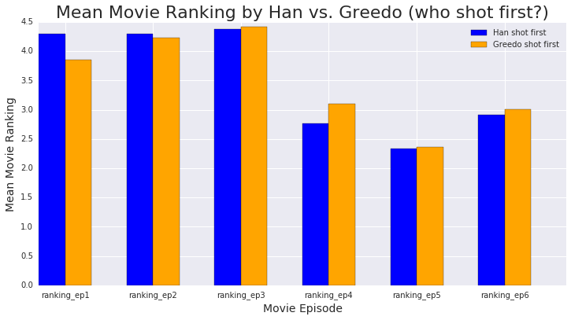
    


The differences in the movie rankings by the 'Which character shot first?' subsets are not very different. What is interesting however, is that this is the first time we see the rankings differ from the order of most to least seen for any of the subsets. <br/>
<br/>
**'Han shot first' group's ranked movies in order of best to worst: <br/>
Episode V<br/>
Episode IV<br/>
Episode VI<br/> 
Episode I<br/> 
Episode II<br/>
Episode III <br/>
<br/>
'Greedo shot first' group's ranked movies in order of best to worst <br/>
Episode V<br/>
Episode VI <br/>
Episode IV <br/>
Episode I <br/>
Episode II <br/>
Episode III**<br/>
<br/>
We can see that the only difference in the rankings is that Han fans ranked Episode IV over Episode VI and Greedo fans ranked those vice-versa.

## Segmenting the data based on respondants' Education


```python
print(star_wars['Education'].value_counts(dropna=False))

```

    Some college or Associate degree    328
    Bachelor degree                     321
    Graduate degree                     275
    NaN                                 150
    High school degree                  105
    Less than high school degree          7
    Name: Education, dtype: int64


```python
#cleaning the values so they're easier to work with
star_wars['Education'] = star_wars['Education'].str.replace(' degree', '')
star_wars['Education'] = star_wars['Education'].dropna()
edu_value_counts = (star_wars['Education'].value_counts())
print (edu_value_counts)
```

    Some college or Associate    328
    Bachelor                     321
    Graduate                     275
    High school                  105
    Less than high school          7
    Name: Education, dtype: int64


```python
#removing 'Less than high school' since it has too few respondants to analyze
to_remove = star_wars['Education'] == 'Less than high school'
star_wars['Education'] = star_wars['Education'][~to_remove]
edu_value_counts = (star_wars['Education'].value_counts())
print (edu_value_counts)

```

    Some college or Associate    328
    Bachelor                     321
    Graduate                     275
    High school                  105
    Name: Education, dtype: int64


```python
#filtering the data by each education level
sw_edu_some = star_wars[star_wars['Education'] == 'Some college or Associate']
sw_edu_bach = star_wars[star_wars['Education'] == 'Bachelor']
sw_edu_grad = star_wars[star_wars['Education'] == 'Graduate']
sw_edu_hs = star_wars[star_wars['Education'] == 'High school']

```


```python
#summing the seen movie columns by each education level subset
seen_sum_sw_edu_some = sw_edu_some[sw_edu_some.columns[3:9]].sum()
print (seen_sum_sw_edu_some)
print ('\n')
seen_sum_sw_edu_bach = sw_edu_bach[sw_edu_bach.columns[3:9]].sum()
print (seen_sum_sw_edu_bach)
print ('\n')
seen_sum_sw_edu_grad = sw_edu_grad[sw_edu_grad.columns[3:9]].sum()
print (seen_sum_sw_edu_grad)
print ('\n')
seen_sum_sw_edu_hs = sw_edu_hs[sw_edu_hs.columns[3:9]].sum()
print (seen_sum_sw_edu_hs)
print ('\n')

```

    seen_ep1    211
    seen_ep2    186
    seen_ep3    183
    seen_ep4    180
    seen_ep5    227
    seen_ep6    223
    dtype: int64
    
    
    seen_ep1    206
    seen_ep2    170
    seen_ep3    163
    seen_ep4    195
    seen_ep5    243
    seen_ep6    234
    dtype: int64
    
    
    seen_ep1    179
    seen_ep2    149
    seen_ep3    139
    seen_ep4    163
    seen_ep5    207
    seen_ep6    201
    dtype: int64
    
    
    seen_ep1    57
    seen_ep2    48
    seen_ep3    48
    seen_ep4    53
    seen_ep5    61
    seen_ep6    60
    dtype: int64
    
    


```python
#Plotting seen movie data by Education level of respondants
N = 6

# values of blue bars (height)
seen_somecollege = (seen_sum_sw_edu_some)
# values of orange bars (height)
seen_bachelors = (seen_sum_sw_edu_bach)
# values of purple bars (height)
seen_grad = (seen_sum_sw_edu_grad)
# values of green bars (height)
seen_hs = (seen_sum_sw_edu_hs)

# Position of bars on x-axis
ind = np.arange(N)

# Figure size
plt.figure(figsize=(12,6))

# Width of a bar 
width = 0.18       

# Plotting
plt.bar(ind, seen_somecollege, width, color='blue', label='Some College')
plt.bar(ind + width, seen_bachelors, width, color='orange', label='Bachelors')
plt.bar(ind + width * 2, seen_grad, width, color='purple', label='Graduate')
plt.bar(ind + width * 3, seen_hs, width, color='green', label='High School')


plt.xlabel('Seen Movie Sum', size=14)
plt.ylabel('# of Respondants Seen Movie', size=14)
plt.title('Seen Movie Sum by Education Level of Respondants', size=22)

# xticks()
# First argument - A list of positions at which ticks should be placed
# Second argument -  A list of labels to place at the given locations
plt.xticks(ind + (width*2), ('seen_ep1', 'seen_ep2', 'seen_ep3', 'seen_ep4', 'seen_ep5', 'seen_ep6'))

# Finding the best position for legends and putting it
plt.legend(loc='best')
plt.show()
```


    
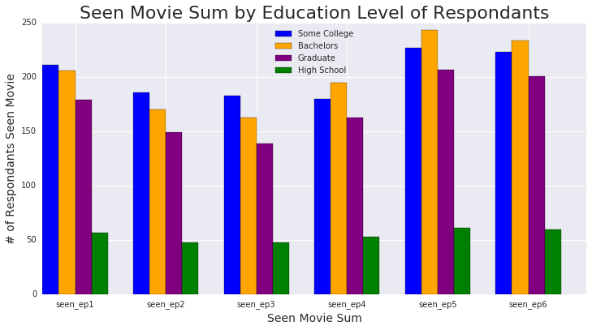
    


In general there are far less respondants who have only graduated high school (or less) than any of the higher education respondants so that's a major reason for the discrepancy we see in the above chart. It would be interesting to see this as a percentage vs. just amounts.


```python
#calculating percentage of seen movie columns by education level subsets
per_seen_by_edu_some = (seen_sum_sw_edu_some / edu_value_counts[0]) *100
print (per_seen_by_edu_some)
print ('\n')

per_seen_by_edu_bach = (seen_sum_sw_edu_bach / edu_value_counts[1]) *100
print (per_seen_by_edu_bach)
print ('\n')

per_seen_by_edu_grad = (seen_sum_sw_edu_grad / edu_value_counts[2]) *100
print (per_seen_by_edu_grad)
print ('\n')

per_seen_by_edu_hs = (seen_sum_sw_edu_hs / edu_value_counts[3]) *100
print (per_seen_by_edu_hs)
print ('\n')


```

    seen_ep1    64.329268
    seen_ep2    56.707317
    seen_ep3    55.792683
    seen_ep4    54.878049
    seen_ep5    69.207317
    seen_ep6    67.987805
    dtype: float64
    
    
    seen_ep1    64.174455
    seen_ep2    52.959502
    seen_ep3    50.778816
    seen_ep4    60.747664
    seen_ep5    75.700935
    seen_ep6    72.897196
    dtype: float64
    
    
    seen_ep1    65.090909
    seen_ep2    54.181818
    seen_ep3    50.545455
    seen_ep4    59.272727
    seen_ep5    75.272727
    seen_ep6    73.090909
    dtype: float64
    
    
    seen_ep1    54.285714
    seen_ep2    45.714286
    seen_ep3    45.714286
    seen_ep4    50.476190
    seen_ep5    58.095238
    seen_ep6    57.142857
    dtype: float64
    
    


```python
#Plotting seen movie data by Education level of respondants by percentage
N = 6

# values of blue bars (height)
seenper_somecollege = (per_seen_by_edu_some)
# values of orange bars (height)
seenper_bachelors = (per_seen_by_edu_bach)
# values of purple bars (height)
seenper_grad = (per_seen_by_edu_grad)
# values of green bars (height)
seenper_hs = (per_seen_by_edu_hs)


# Position of bars on x-axis
ind = np.arange(N)

# Figure size
plt.figure(figsize=(12,6))

# Width of a bar 
width = 0.18       

# Plotting
plt.bar(ind, seenper_somecollege, width, color='blue', label='Some College')
plt.bar(ind + width, seenper_bachelors, width, color='orange', label='Bachelors')
plt.bar(ind + width * 2, seenper_grad, width, color='purple', label='Graduate')
plt.bar(ind + width * 3, seenper_hs, width, color='green', label='High School')

plt.xlabel('Movies', size=14)
plt.ylabel('% of Respondants Seen Movie', size=14)
plt.title('Seen Movie Sum by Education Level of Respondants by %', size=22)

# xticks()
# First argument - A list of positions at which ticks should be placed
# Second argument -  A list of labels to place at the given locations
plt.xticks(ind + width * 2, ('seen_ep1', 'seen_ep2', 'seen_ep3', 'seen_ep4', 'seen_ep5', 'seen_ep6'))

# Finding the best position for legends and putting it
plt.legend(loc='best')
plt.show()
```


    
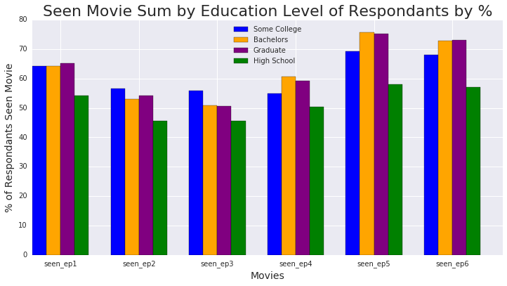
    


What's interesting about the above chart is that respondants with a Bachelor or Graduate degree have a higher rate of having seen Episodes V, VI, and IV (respectively), but that seems to drop off pretty drastically after Episode I (in which they are neck and neck with the respondants with 'Some college or associates degree'). Here, again, we see that Episode V has been seen the most by each subset. We can also see there is a lower overall rate of respondants who have High School level education or less who've seen the movies generally.

## Charting mean ranking for the movies based on education levels of respondants


```python
#calculating mean rankings of movies by education level subsets
mean_rankings_edu_some = sw_edu_some[sw_edu_some.columns[9:15]].mean(skipna=True)
print (mean_rankings_edu_some)
print ('\n')
mean_rankings_edu_bach = sw_edu_bach[sw_edu_bach.columns[9:15]].mean(skipna=True)
print (mean_rankings_edu_bach)
print ('\n')
mean_rankings_edu_grad = sw_edu_grad[sw_edu_grad.columns[9:15]].mean(skipna=True)
print (mean_rankings_edu_grad)
print ('\n')
mean_rankings_edu_hs = sw_edu_hs[sw_edu_hs.columns[9:15]].mean(skipna=True)
print (mean_rankings_edu_hs)
print ('\n')

```

    ranking_ep1    3.551181
    ranking_ep2    3.885827
    ranking_ep3    4.102362
    ranking_ep4    3.503937
    ranking_ep5    2.783465
    ranking_ep6    3.173228
    dtype: float64
    
    
    ranking_ep1    3.828244
    ranking_ep2    4.290076
    ranking_ep3    4.521073
    ranking_ep4    3.114504
    ranking_ep5    2.309160
    ranking_ep6    2.931298
    dtype: float64
    
    
    ranking_ep1    3.822222
    ranking_ep2    4.225664
    ranking_ep3    4.500000
    ranking_ep4    3.199115
    ranking_ep5    2.323009
    ranking_ep6    2.920354
    dtype: float64
    
    
    ranking_ep1    3.802817
    ranking_ep2    3.746479
    ranking_ep3    4.126761
    ranking_ep4    3.211268
    ranking_ep5    2.873239
    ranking_ep6    3.239437
    dtype: float64
    
    


```python
#Plotting movie ranking data by education levels of respondants
N = 6

# values of blue bars (height)
mean_somecollege = (mean_rankings_edu_some)
# values of orange bars (height)
mean_bachelors = (mean_rankings_edu_bach)
# values of purple bars (height)
mean_grad = (mean_rankings_edu_grad)
# values of green bars (height)
mean_hs = (mean_rankings_edu_hs)


# Position of bars on x-axis
ind = np.arange(N)

# Figure size
plt.figure(figsize=(12,6))

# Width of a bar 
width = 0.18       

# Plotting
plt.bar(ind, mean_somecollege, width, color='blue', label='Some College')
plt.bar(ind + width, mean_bachelors, width, color='orange', label='Bachelors')
plt.bar(ind + width * 2, mean_grad, width, color='purple', label='Graduate')
plt.bar(ind + width * 3, mean_hs, width, color='green', label='High School')


plt.xlabel('Movie Episode', size=14)
plt.ylabel('Mean Movie Ranking', size=14)
plt.title('Mean Movie Ranking by Education Level of Respondants', size=22)

# xticks()
# First argument - A list of positions at which ticks should be placed
# Second argument -  A list of labels to place at the given locations
plt.xticks(ind + width / 2, ('ranking_ep1', 'ranking_ep2', 'ranking_ep3', 'ranking_ep4', 'ranking_ep5', 'ranking_ep6'))

# Finding the best position for legends and putting it
plt.legend(loc='best')
plt.show()
```


    
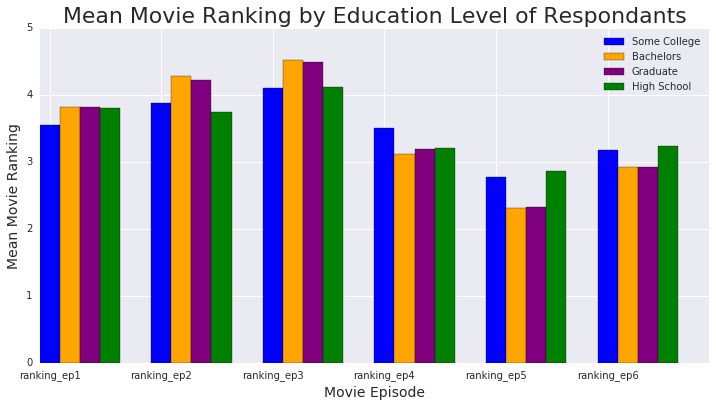
    


Once again, we see that every subset ranked Episode V: The Empire Strikes Back as the best movie of the series. Here, as we've seen before, Episodes VI and IV fall close behind Episode V and then Episodes I, II, and III come after that respectively. There isn't much deviation here between the subsets and we can exclude the 'Less than 

## Cleaning up columns 15-29 about character favorability


```python
#Looking into columns 15-29
character_cols = [15,16,17,18,19,20,21,22,23,24,25,26,27,28]

for i in character_cols:
    print (star_wars.columns[i])
    print (star_wars[star_wars.columns[i]].value_counts(dropna=False))
    print('\n')
```

    Please state whether you view the following characters favorably, unfavorably, or are unfamiliar with him/her.
    Very favorably                                 610
    NaN                                            357
    Somewhat favorably                             151
    Neither favorably nor unfavorably (neutral)     44
    Unfamiliar (N/A)                                15
    Somewhat unfavorably                             8
    Very unfavorably                                 1
    Name: Please state whether you view the following characters favorably, unfavorably, or are unfamiliar with him/her., dtype: int64
    
    
    Unnamed: 16
    Very favorably                                 552
    NaN                                            355
    Somewhat favorably                             219
    Neither favorably nor unfavorably (neutral)     38
    Somewhat unfavorably                            13
    Unfamiliar (N/A)                                 6
    Very unfavorably                                 3
    Name: Unnamed: 16, dtype: int64
    
    
    Unnamed: 17
    Very favorably                                 547
    NaN                                            355
    Somewhat favorably                             210
    Neither favorably nor unfavorably (neutral)     48
    Somewhat unfavorably                            12
    Unfamiliar (N/A)                                 8
    Very unfavorably                                 6
    Name: Unnamed: 17, dtype: int64
    
    
    Unnamed: 18
    NaN                                            363
    Somewhat favorably                             269
    Very favorably                                 245
    Neither favorably nor unfavorably (neutral)    135
    Somewhat unfavorably                            83
    Unfamiliar (N/A)                                52
    Very unfavorably                                39
    Name: Unnamed: 18, dtype: int64
    
    
    Unnamed: 19
    Very favorably                                 591
    NaN                                            361
    Somewhat favorably                             159
    Neither favorably nor unfavorably (neutral)     43
    Unfamiliar (N/A)                                17
    Somewhat unfavorably                             8
    Very unfavorably                                 7
    Name: Unnamed: 19, dtype: int64
    
    
    Unnamed: 20
    NaN                                            372
    Neither favorably nor unfavorably (neutral)    213
    Unfamiliar (N/A)                               156
    Somewhat favorably                             143
    Very unfavorably                               124
    Very favorably                                 110
    Somewhat unfavorably                            68
    Name: Unnamed: 20, dtype: int64
    
    
    Unnamed: 21
    NaN                                            360
    Very favorably                                 310
    Somewhat favorably                             171
    Very unfavorably                               149
    Somewhat unfavorably                           102
    Neither favorably nor unfavorably (neutral)     84
    Unfamiliar (N/A)                                10
    Name: Unnamed: 21, dtype: int64
    
    
    Unnamed: 22
    NaN                                            366
    Neither favorably nor unfavorably (neutral)    236
    Somewhat favorably                             223
    Unfamiliar (N/A)                               148
    Very favorably                                 142
    Somewhat unfavorably                            63
    Very unfavorably                                 8
    Name: Unnamed: 22, dtype: int64
    
    
    Unnamed: 23
    NaN                                            374
    Neither favorably nor unfavorably (neutral)    248
    Somewhat favorably                             153
    Very favorably                                 138
    Unfamiliar (N/A)                               132
    Somewhat unfavorably                            96
    Very unfavorably                                45
    Name: Unnamed: 23, dtype: int64
    
    
    Unnamed: 24
    Very favorably                                 474
    NaN                                            359
    Somewhat favorably                             229
    Neither favorably nor unfavorably (neutral)     79
    Somewhat unfavorably                            23
    Unfamiliar (N/A)                                15
    Very unfavorably                                 7
    Name: Unnamed: 24, dtype: int64
    
    
    Unnamed: 25
    Very favorably                                 562
    NaN                                            356
    Somewhat favorably                             185
    Neither favorably nor unfavorably (neutral)     57
    Somewhat unfavorably                            10
    Unfamiliar (N/A)                                10
    Very unfavorably                                 6
    Name: Unnamed: 25, dtype: int64
    
    
    Unnamed: 26
    NaN                                            365
    Very unfavorably                               204
    Neither favorably nor unfavorably (neutral)    164
    Somewhat favorably                             130
    Very favorably                                 112
    Unfamiliar (N/A)                               109
    Somewhat unfavorably                           102
    Name: Unnamed: 26, dtype: int64
    
    
    Unnamed: 27
    NaN                                            372
    Neither favorably nor unfavorably (neutral)    207
    Somewhat favorably                             183
    Very favorably                                 168
    Unfamiliar (N/A)                               164
    Somewhat unfavorably                            58
    Very unfavorably                                34
    Name: Unnamed: 27, dtype: int64
    
    
    Unnamed: 28
    Very favorably                                 605
    NaN                                            360
    Somewhat favorably                             144
    Neither favorably nor unfavorably (neutral)     51
    Unfamiliar (N/A)                                10
    Somewhat unfavorably                             8
    Very unfavorably                                 8
    Name: Unnamed: 28, dtype: int64
    
    


Since the value counts don't give us the character names, let's look at the headings we separated out earlier.


```python
#Looking into the headings for columns 15-28

print (headings[15:29])
```

    Please state whether you view the following characters favorably, unfavorably, or are unfamiliar with him/her.                Han Solo
    Unnamed: 16                                                                                                             Luke Skywalker
    Unnamed: 17                                                                                                       Princess Leia Organa
    Unnamed: 18                                                                                                           Anakin Skywalker
    Unnamed: 19                                                                                                             Obi Wan Kenobi
    Unnamed: 20                                                                                                          Emperor Palpatine
    Unnamed: 21                                                                                                                Darth Vader
    Unnamed: 22                                                                                                           Lando Calrissian
    Unnamed: 23                                                                                                                  Boba Fett
    Unnamed: 24                                                                                                                      C-3P0
    Unnamed: 25                                                                                                                      R2 D2
    Unnamed: 26                                                                                                              Jar Jar Binks
    Unnamed: 27                                                                                                              Padme Amidala
    Unnamed: 28                                                                                                                       Yoda
    Name: 0, dtype: object


```python
#Cleaning the answers for readability

answer_map = {'Very favorably': 'love',
             'Somewhat favorably': 'like',
             'Neither favorably nor unfavorably (neutral)': 'Neutral',
             'Somewhat unfavorably': 'dislike',
             'Unfamiliar (N/A)': 'Unfamiliar',
             'Very unfavorably': 'hate',
             }
char_map = {'Please state whether you view the following characters favorably, unfavorably, or are unfamiliar with him/her.': 'Han Solo',
            'Unnamed: 16': 'Luke Skywalker',
            'Unnamed: 17': 'Princess Leia Organa',
            'Unnamed: 18': 'Anakin Skywalker',
            'Unnamed: 19': 'Obi Wan Kenobi',
            'Unnamed: 20': 'Emperor Palpatine',
            'Unnamed: 21': 'Darth Vader',
            'Unnamed: 22': 'Lando Calrissian',
            'Unnamed: 23': 'Boba Fett',
            'Unnamed: 24': 'C-3P0',
            'Unnamed: 25': 'R2 D2',
            'Unnamed: 26': 'Jar Jar Binks',
            'Unnamed: 27': 'Padme Amidala',
            'Unnamed: 28': 'Yoda'}
    
for i in character_cols:
    star_wars[star_wars.columns[i]] = star_wars[star_wars.columns[i]].map(answer_map)
    star_wars.rename(mapper=char_map, axis=1, inplace=True)
    print (star_wars[star_wars.columns[i]].value_counts())
    print ('\n')

```

    love          610
    like          151
    Neutral        44
    Unfamiliar     15
    dislike         8
    hate            1
    Name: Han Solo, dtype: int64
    
    
    love          552
    like          219
    Neutral        38
    dislike        13
    Unfamiliar      6
    hate            3
    Name: Luke Skywalker, dtype: int64
    
    
    love          547
    like          210
    Neutral        48
    dislike        12
    Unfamiliar      8
    hate            6
    Name: Princess Leia Organa, dtype: int64
    
    
    like          269
    love          245
    Neutral       135
    dislike        83
    Unfamiliar     52
    hate           39
    Name: Anakin Skywalker, dtype: int64
    
    
    love          591
    like          159
    Neutral        43
    Unfamiliar     17
    dislike         8
    hate            7
    Name: Obi Wan Kenobi, dtype: int64
    
    
    Neutral       213
    Unfamiliar    156
    like          143
    hate          124
    love          110
    dislike        68
    Name: Emperor Palpatine, dtype: int64
    
    
    love          310
    like          171
    hate          149
    dislike       102
    Neutral        84
    Unfamiliar     10
    Name: Darth Vader, dtype: int64
    
    
    Neutral       236
    like          223
    Unfamiliar    148
    love          142
    dislike        63
    hate            8
    Name: Lando Calrissian, dtype: int64
    
    
    Neutral       248
    like          153
    love          138
    Unfamiliar    132
    dislike        96
    hate           45
    Name: Boba Fett, dtype: int64
    
    
    love          474
    like          229
    Neutral        79
    dislike        23
    Unfamiliar     15
    hate            7
    Name: C-3P0, dtype: int64
    
    
    love          562
    like          185
    Neutral        57
    Unfamiliar     10
    dislike        10
    hate            6
    Name: R2 D2, dtype: int64
    
    
    hate          204
    Neutral       164
    like          130
    love          112
    Unfamiliar    109
    dislike       102
    Name: Jar Jar Binks, dtype: int64
    
    
    Neutral       207
    like          183
    love          168
    Unfamiliar    164
    dislike        58
    hate           34
    Name: Padme Amidala, dtype: int64
    
    
    love          605
    like          144
    Neutral        51
    Unfamiliar     10
    dislike         8
    hate            8
    Name: Yoda, dtype: int64
    
    


```python
#separating each character into their own object and separating only 'love' values
han_solo = (star_wars['Han Solo'])
han_love = (len(han_solo[han_solo == 'love']))
print (han_love)
print ('\n')

luke = (star_wars['Luke Skywalker'])
luke_love = (len(luke[luke == 'love']))
print (luke_love)
print ('\n')

leia = (star_wars['Princess Leia Organa'])
leia_love = (len(leia[leia == 'love']))
print (leia_love)
print ('\n')

anakin = (star_wars['Anakin Skywalker'])
anakin_love = (len(anakin[anakin == 'love']))
print (anakin_love)
print ('\n')

obi_wan = (star_wars['Obi Wan Kenobi'])
obi_love = (len(obi_wan[obi_wan == 'love']))
print (obi_love)
print ('\n')

palpatine = (star_wars['Emperor Palpatine'])
palpatine_love = (len(palpatine[palpatine == 'love']))
print (palpatine_love)
print ('\n')

vader = (star_wars['Darth Vader'])
vader_love = (len(vader[vader == 'love']))
print (vader_love)
print ('\n')

lando = (star_wars['Lando Calrissian'])
lando_love = (len(lando[lando == 'love']))
print (lando_love)
print ('\n')

boba = (star_wars['Boba Fett'])
boba_love = (len(boba[boba == 'love']))
print (boba_love)
print ('\n')

c3p0 = (star_wars['C-3P0'])
c3p0_love = (len(c3p0[c3p0 == 'love']))
print (c3p0_love)
print ('\n')

r2d2 = (star_wars['R2 D2'])
r2d2_love = (len(r2d2[r2d2 == 'love']))
print (r2d2_love)
print ('\n')

jarjar = (star_wars['Jar Jar Binks'])
jarjar_love = (len(jarjar[jarjar == 'love']))
print (jarjar_love)
print ('\n')

padme = (star_wars['Padme Amidala'])
padme_love = (len(padme[padme == 'love']))
print (padme_love)
print ('\n')

yoda = (star_wars['Yoda'])
yoda_love = (len(yoda[yoda == 'love']))
print (yoda_love)
print ('\n')

characters_love = [han_love, luke_love, leia_love, anakin_love, obi_love, palpatine_love, vader_love,
                  lando_love, boba_love, c3p0_love, r2d2_love, jarjar_love, padme_love, yoda_love]
print (characters_love)
```

    610
    
    
    552
    
    
    547
    
    
    245
    
    
    591
    
    
    110
    
    
    310
    
    
    142
    
    
    138
    
    
    474
    
    
    562
    
    
    112
    
    
    168
    
    
    605
    
    
    [610, 552, 547, 245, 591, 110, 310, 142, 138, 474, 562, 112, 168, 605]


```python
#Plotting characters by love (highly favorable)
N = 14

# values of blue bars (height)
character_love_bar = (characters_love)


# Position of bars on x-axis
ind = np.arange(N)

# Figure size
plt.figure(figsize=(12,6))

# Width of a bar 
width = 0.3       

# Plotting
plt.bar(ind, character_love_bar, width, color='blue')


plt.xlabel('Characters', size=14)
plt.ylabel('High Favorability (love)', size=14)
plt.title('High Favorability by Character', size=22)

# xticks()
# First argument - A list of positions at which ticks should be placed
# Second argument -  A list of labels to place at the given locations
plt.xticks(ind + width / 2, ('Han', 'Luke', 'Leia', 'Anakin', 'Obi', 'Palpatine', 'Vader',
          'Lando', 'Boba', 'C-3P0', 'R2D2', 'Jar Jar', 'Padme', 'Yoda'), rotation='45')

# Show plot
plt.show()
```


    
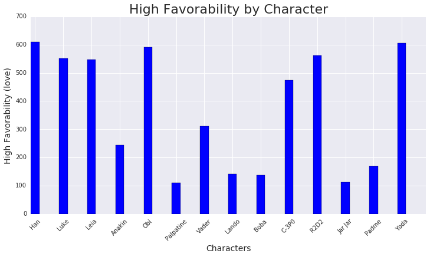
    


Unsurprisingly, Han Solo and Yoda are the top 2 most liked (highly favorable) characters. Obi-Wan Kenobi and R2D2 follow them in likeability, which is also not surprising as these are 4 of the most iconic and likeable characters in the franchise. What is a bit surprising is that JarJar Binks is the 2nd least loved character, just slightly above Emperor Palpatine - who is the biggest villain in the franchise.

## Looking at characters by 'hate' responses


```python
#separating each character into their own object and separating only 'love' values
han_solo = (star_wars['Han Solo'])
han_hate = (len(han_solo[han_solo == 'hate']))
print (han_hate)
print ('\n')

luke = (star_wars['Luke Skywalker'])
luke_hate = (len(luke[luke == 'hate']))
print (luke_hate)
print ('\n')

leia = (star_wars['Princess Leia Organa'])
leia_hate = (len(leia[leia == 'hate']))
print (leia_hate)
print ('\n')

anakin = (star_wars['Anakin Skywalker'])
anakin_hate = (len(anakin[anakin == 'hate']))
print (anakin_hate)
print ('\n')

obi_wan = (star_wars['Obi Wan Kenobi'])
obi_hate = (len(obi_wan[obi_wan == 'hate']))
print (obi_hate)
print ('\n')

palpatine = (star_wars['Emperor Palpatine'])
palpatine_hate = (len(palpatine[palpatine == 'hate']))
print (palpatine_hate)
print ('\n')

vader = (star_wars['Darth Vader'])
vader_hate = (len(vader[vader == 'hate']))
print (vader_hate)
print ('\n')

lando = (star_wars['Lando Calrissian'])
lando_hate = (len(lando[lando == 'hate']))
print (lando_hate)
print ('\n')

boba = (star_wars['Boba Fett'])
boba_hate = (len(boba[boba == 'hate']))
print (boba_hate)
print ('\n')

c3p0 = (star_wars['C-3P0'])
c3p0_hate = (len(c3p0[c3p0 == 'hate']))
print (c3p0_hate)
print ('\n')

r2d2 = (star_wars['R2 D2'])
r2d2_hate = (len(r2d2[r2d2 == 'hate']))
print (r2d2_hate)
print ('\n')

jarjar = (star_wars['Jar Jar Binks'])
jarjar_hate = (len(jarjar[jarjar == 'hate']))
print (jarjar_hate)
print ('\n')

padme = (star_wars['Padme Amidala'])
padme_hate = (len(padme[padme == 'hate']))
print (padme_hate)
print ('\n')

yoda = (star_wars['Yoda'])
yoda_hate = (len(yoda[yoda == 'hate']))
print (yoda_hate)
print ('\n')

characters_hate = [han_hate, luke_hate, leia_hate, anakin_hate, obi_hate, palpatine_hate, vader_hate,
                  lando_hate, boba_hate, c3p0_hate, r2d2_hate, jarjar_hate, padme_hate, yoda_hate]
print (characters_hate)

```

    1
    
    
    3
    
    
    6
    
    
    39
    
    
    7
    
    
    124
    
    
    149
    
    
    8
    
    
    45
    
    
    7
    
    
    6
    
    
    204
    
    
    34
    
    
    8
    
    
    [1, 3, 6, 39, 7, 124, 149, 8, 45, 7, 6, 204, 34, 8]


```python
#Plotting characters by hate (highly unfavorable)
N = 14

# values of blue bars (height)
character_hate_bar = (characters_hate)


# Position of bars on x-axis
ind = np.arange(N)

# Figure size
plt.figure(figsize=(12,6))

# Width of a bar 
width = 0.3       

# Plotting
plt.bar(ind, character_hate_bar, width, color='red')


plt.xlabel('Characters', size=14)
plt.ylabel('High Unfavorability (hate)', size=14)
plt.title('High Unfavorability by Character', size=22)

# xticks()
# First argument - A list of positions at which ticks should be placed
# Second argument -  A list of labels to place at the given locations
plt.xticks(ind + width / 2, ('Han', 'Luke', 'Leia', 'Anakin', 'Obi', 'Palpatine', 'Vader',
          'Lando', 'Boba', 'C-3P0', 'R2D2', 'Jar Jar', 'Padme', 'Yoda'), rotation='45')

# Show plot
plt.show()
```


    
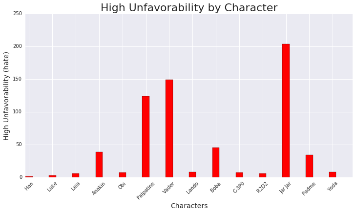
    


Surprisingly, JarJar Binks beats out Emporer Palpatine as the most hated (most unfavorable) character out of the 14 characters in the survey. Also surprising is how many people hate Boba Fett, who is usually known as a fan favorite.

The most controversial character according to these two charts, is Darth Vader. He has a fairly high favorablitity with 310 responses, and also a fairly high unfavorability with 149 responses. As Vader is one of the most complex characters in the franchise, having started out on the right path as Anakin Skywalker, then turning to the dark side as he grew more angry and hateful, only to then reveal himself to his son and somehow redeam himself before his death, it stands to reason that survey respondants would be the most split on whether they love or hate him. He is also known as a "badass" type of character, which many admire, and that also explains the fairly high amount of love that this villain got here.

# Conclusions based on survey data analysis

### I. Based on the above findings, I think it's safe to say that Episode V: The Empire Strikes Back is the clear favorite of the Star Wars film franchise (Episodes I-VI).<br/>
* Amongst every subgroup analysed in this study: male, female, fans of the films, non-fans of the films, which character shot first answers, and education levels of respondants, as well as the overall analysis, and we found that Episode V was consistantly ranked the best. 
* We also concluded that Episode III: Revenge of the Sith was consistantly ranked the worst of the 6 films. <br/>

### II. Some of the other interesting findings from this study are: 
* More males than females watched the films <br/>
* Males and females ranked the movies differently except for the best and worst in their rankings
* Females were more fond of some of the newer films (episode I and episode II) and didn't like the original Episode IV as much as males
* Males tend to be loyalists to the original three movies and ranked the newer three (episodes I, II, III respectively) last
* Fans of the franchise are loyalists to the original three films (Episodes IV-VI) and did not like the newer films as much (Episodes I-III)<br/>
* Non-fans did not like Episode IV as much as fans did and ranked Episodes I and II higher than fans ranked them. <br/>
* While education level did not seem to affect ranking of movies, we saw that respondants with higher than high school level education were more likely to have seen the movies in general. <br/>

### III. As far as the characters, there isn't much surprise in who's most and least favorable, except that JarJar Binks is even less favorable than the most evil villain in the franchise: Emporer Palpatine. 
* The most favorable are Han Solo, followed closely by Yoda who are both known fan favorites. <br/>
* The least favorable is JarJar Binks, followed by Emporer Palpatine. <br/>
* The most controversial character is Darth Vader with the most split vote of favorability
